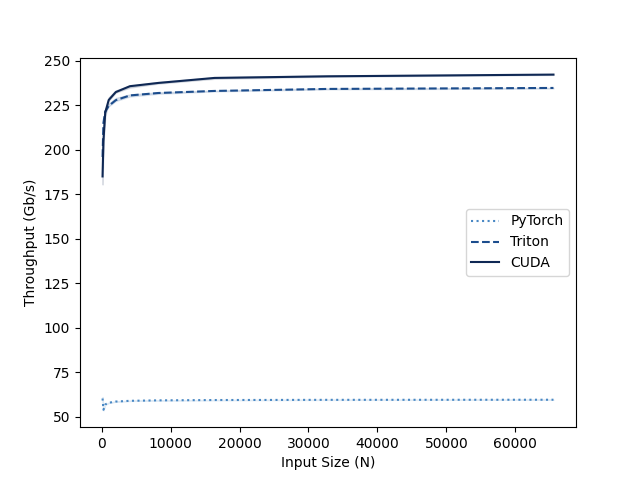
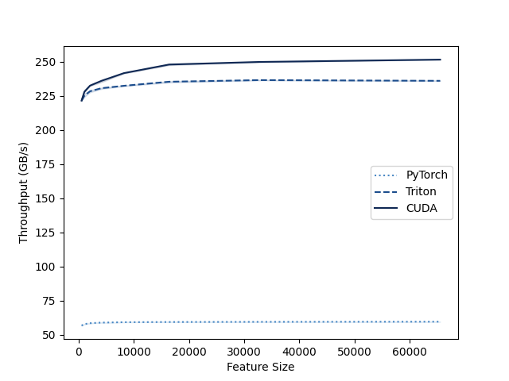
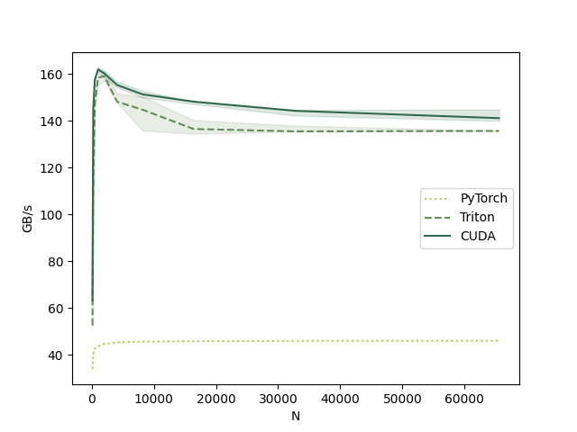
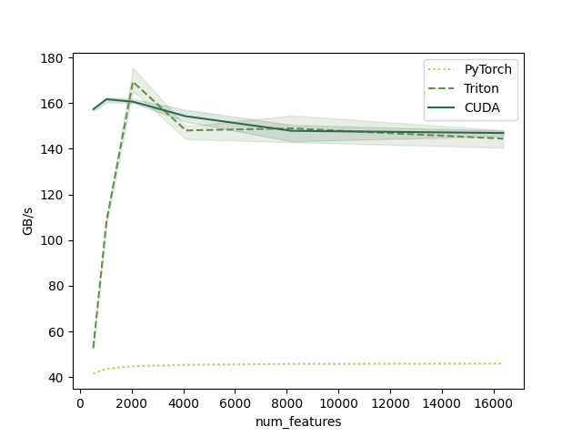

# Kernels implementation of Dynamic Tanh (DyT)

Efficient Triton and CUDA implementations of Dynamic Tanh (DyT).

## Description

Dynamic Tanh (DyT) is a normalization-free activation function proposed as a replacement for LayerNorm/RMSNorm in transformer architectures. It applies a learnable scaling factor to the input before a Tanh nonlinearity, followed by an affine transformation.

$$
DyT(x) = \tanh(\alpha \cdot x) \cdot w + b
$$

referenced the following paper: [Transformers without Normalization](https://arxiv.org/abs/2503.10622). CVPR 2025. [Jiachen Zhu](https://jiachenzhu.github.io), [Xinlei Chen](https://xinleic.xyz/), [Kaiming He](https://people.csail.mit.edu/kaiming/), [Yann LeCun](http://yann.lecun.com) and [Zhuang Liu](https://liuzhuang13.github.io). FAIR, NYU, MIT, Princeton [[`arXiv`](https://arxiv.org/abs/2503.10622)][[`project page`](https://jiachenzhu.github.io/DyT/)]

## Benchmark Results

| | |
| :---: | :---: |
| **Forward N-Scaling**  | **Forward Feature-Scaling**  |
| **Backward N-Scaling**  | **Backward Feature-Scaling**  |
