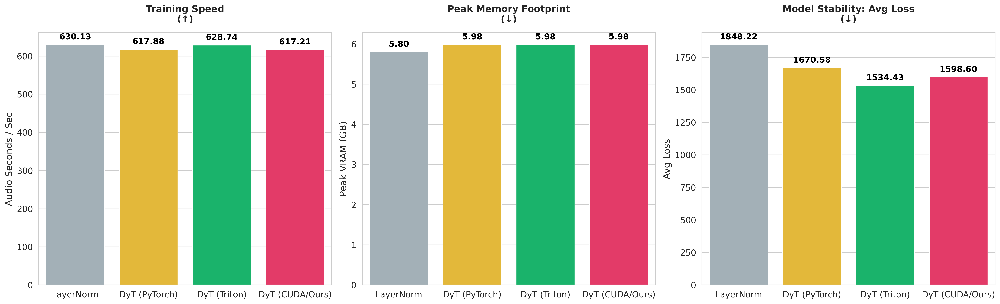
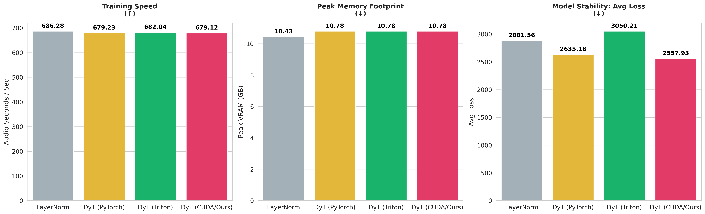
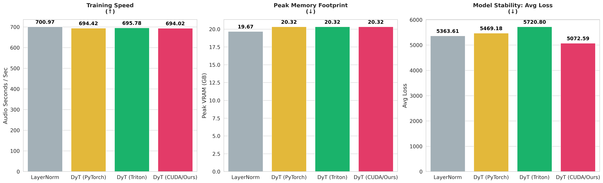
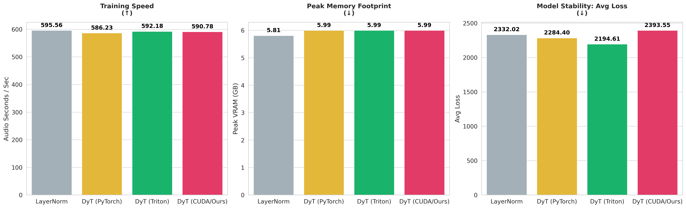
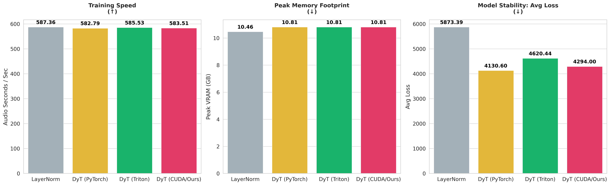
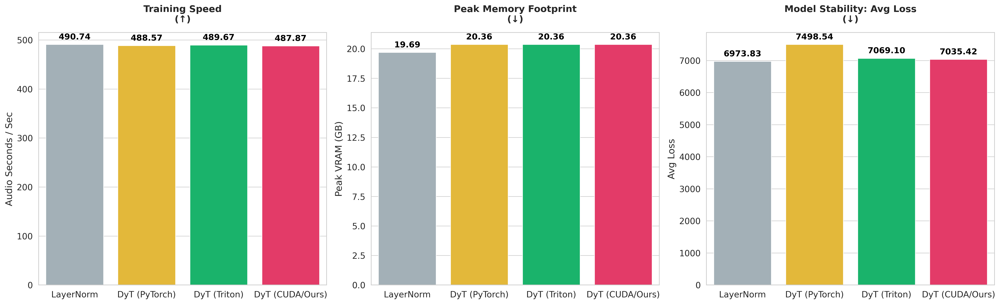
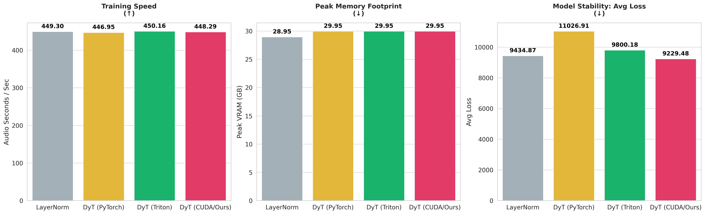

# Kernels implementation of Dynamic Tanh (DyT)

Efficient Triton and CUDA implementations of Dynamic Tanh (DyT).

### Description

Dynamic Tanh (DyT) is a normalization-free activation function proposed as a replacement for LayerNorm/RMSNorm in transformer architectures. It applies a learnable scaling factor to the input before a Tanh nonlinearity, followed by an affine transformation.

$$
DyT(x) = \tanh(\alpha \cdot x) \cdot w + b
$$

referenced the following paper: [Transformers without Normalization](https://arxiv.org/abs/2503.10622). CVPR 2025. [Jiachen Zhu](https://jiachenzhu.github.io), [Xinlei Chen](https://xinleic.xyz/), [Kaiming He](https://people.csail.mit.edu/kaiming/), [Yann LeCun](http://yann.lecun.com) and [Zhuang Liu](https://liuzhuang13.github.io). FAIR, NYU, MIT, Princeton [[`arXiv`](https://arxiv.org/abs/2503.10622)][[`project page`](https://jiachenzhu.github.io/DyT/)]

### Benchmark Results
We benchmark the forward and backward throughput of Cuda DyT compared with Triton and Pytorch efficiency. 
| | |
| :---: | :---: |
| **Forward N-Scaling**  | **Forward Feature-Scaling**  |
| **Backward N-Scaling**  | **Backward Feature-Scaling**  |

### Pretraining Benchmark

We benchmark the model wav2vec 2.0 pre-training efficiency using DyT. The benchmark compares the training step time across different implementations (PyTorch, Triton, CUDA) against a baseline LayerNorm implementation. This study is conducted on an *NVIDIA RTX 5090 32GB* with a fixed training steps of 200 and seed 42.

**Effect of Batch Size w. Fixed Seq. Len. = 5s**

| | | |
| :---: | :---: | :---: |
| **Batch Size 8**  | **Batch Size 16**  | **Batch Size 32**  |

**Effect of Seq. Len. w Fixed Batch Size of 4**

| | | 
| :---: | :---: | 
| **Seq Len 10s**  | **Seq Len 20s**  |
| **Seq Len 40s**  | **Seq Len 60s**  |

### LICENSE

This project is licensed under the MIT License. Please refer to the [LICENSE](LICENSE) file for more details.
